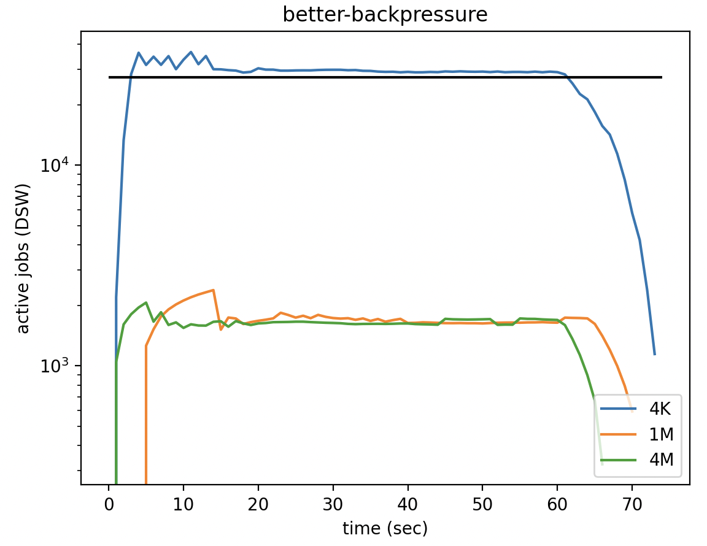

= Crucible Upstairs Backpressure
Matt Keeter <matt@oxide.computer>
2023-11-13

--

As we have improved the performance of the Crucible Upstairs, an issue has
emerged: it's possible to submit `BlockOp` jobs much faster than they can be
handled.  This is exacerbated by the
https://github.com/oxidecomputer/crucible/pull/874["fast ack" optimization]:
according to our contract, we can acknowledge writes to the caller immediately,
without waiting for them to actually complete.  The next flush or read
operation, however, will have to wait for all of those writes to _actually_
finish, meaning it will take a surprisingly long time.

(See https://github.com/oxidecomputer/crucible/issues/902[crucible#902] for an
example of this behavior leading to the host reporting disk errors!)

To fight this issue, we implemented backpressure on guest operations (most
recently in https://github.com/oxidecomputer/crucible/pull/990[crucible#990]).
However, it's still not perfect: especially on unencrypted volumes (which lack
the unintentional backpressure of encryption), the right pattern of large block
writes can lead to pile-ups in various queues.

This document explains the various places where backpressure and queue limits
are implemented, explains limitations of the current implementation, and
suggests a path forward.

--
== Queues in the Crucible Upstairs

The diagram below summarizes major queues and limits in the system:

```mermaid
flowchart TD
    G["Guest::write(..)"] --> BP{{Backpressure}}
    BP --> R(Guest::reqs)
    R -.-> C["Guest::consume_req(..)"]
    C -->|IOP / BW limits| P["process_new_io"]
    P -->D(Downstairs::ds_new)
    D -->|Clamp to MAX_ACTIVE_COUNT| A(In-progress jobs)
    A --> TLW{{Total live work}}
    D --> TLW
    TLW -->|Job count > IO_OUTSTANDING_MAX| L["gone_too_long fault"]
    TLW -.->|Bytes in flight| BP
    TLW -.->|Job count| BP
```


== Backpressure implementation
The current backpressure implementation is based on two values:

- Total write bytes in flight
- Live job count (i.e. the number of new and in-progress jobs)

Backpressure is calculated as the maximum of two computed values:

- Backpressure due to write bytes, which begins at 1 GiB in-flight and has a
  quadratic scale such that there's a delay of 10 ms at 2 GiB in-flight.
- Backpressure due to live job count, which starts at `0.5 * IO_OUTSTANDING_MAX`
  and has a quadratic scale with a maximum delay of 5ms at `IO_OUTSTANDING_MAX`.

(For more on the philosophy of quadratic backpressure, see
https://ahl.dtrace.org/2014/02/10/the-openzfs-write-throttle/[this blog post]
on the ZFS write throttle)

Using the maximum of these two values makes backpressure robust against both
small and large write jobs.  Comparing active jobs at a variety of write sizes,
we see the following:



For small writes, we're limited by total jobs; the black line indicates where
backpressure kicks in at `IO_OUTSTANDING_MAX / 2`.  Large writes stabilize at
fewer outstanding jobs, presumably due to the bytes-in-flight backpressure.

WARNING: It's a little surprising that both 1M and 4M writes stabilize at the same
number of jobs in flight; I should double-check and seek to understand these
values

The backpressure is implemented as an artificial delay before returning when
performing a write operation (only); reads and flushes actually wait for the
operation to complete, so they don't need artificial backpressure.

There's one subtlety here: once backpressure kicks in, the writer must hold a
mutex lock during the backpressure delay.  Otherwise, arbitrarily many writers
can send writes simultaneously; even though each one is delayed by backpressure,
it would still be possible to overwhelm the system.  We saw this in practice:
Propolis uses an 8-task worker pool to send jobs to Crucible, so our initial
backpressure implementation didn't slow things down fast enough.

== Mental model for throughput backpressure
The current backpressure implementation can be thought of as "throughput
backpressure": given an infinite stream of incoming writes, the system
stabilizes at a point where the backpressure delay matches the true time to
complete each write.

In other words, the system stabilizes in a "one-in, one-out" state: each new
write is delayed for long enough that the oldest write in the queue completes as
it's added to the queue.  If the backpressure delay is too short, then the queue
grows (and the delay increases); vice versa if the delay is too long.

In the diagram below, the Upstairs ⟷ Downstairs operation (including
backpressure) matches the Upstairs ⟷ Disk time.

```mermaid
sequenceDiagram
    Guest ->> Upstairs: backpressure
    Upstairs ->> Guest: immediate ack
    Upstairs ->> Downstairs: network
    Downstairs ->> Disk: filesystem
    Disk ->> Downstairs: filesystem
    Downstairs ->> Upstairs: network
```

== Deficiencies of the current system
=== IOP and bandwidth limits do not cause backpressure
In the current implementation, IOP and bandwidth limits are implemented by
limiting the rate at which `Guest::consume_req` can be called (by `up_listen`).
Those limits are not connected to the backpressure system, meaning jobs simply
accumulate Upstairs in `Guest::reqs`, and the guest could use unbounded amounts
of RAM.

This is mitigated by the fact that we never enable IOP or bandwidth limiting.

**Recommendation:** Remove the current IOP and bandwidth limit implementation;
reimplement it as part of the backpressure system further down the road.

=== What is `MAX_ACTIVE_COUNT` doing?
Right now, we limit in-progress jobs (i.e. jobs that are heading through the
network to the Downstairs and back) to 2600 on a per-client basis.  New jobs
above that threshold stay in `ds_new` for that client; they're still counted as
live work for the purposes of other backpressure.  The `MAX_ACTIVE_COUNT` limit
is a hard limit and isn't connected to the rest of the backpressure system.

It's not obvious whether this is accomplishing its goals; it's possible that it
should be removed or be folded into the backpressure system (i.e. as a third
possible source of backpressure).

=== Problematic bytes-in-flight delay
There's a subtle failure mode in our current bytes-in-flight backpressure
limitation.

First, remember that we use "total live jobs" as our indication that a
Downstairs has stopped responding, marking the Downstairs as faulted when total
live jobs reaches `IO_OUTSTANDING_MAX` (by default 57000).

If we send **many small writes** to a Downstairs that is no longer responding,
backpressure will be determined by the "live jobs" limit, which maxes out at 5
ms.  The total delay with our current parameters will be 47 seconds, which does
not seem unreasonable.

However, if we send **large writes**, the backpressure delay will be determined
by the bytes-in-flight limitation, which is not clamped.  As we approach 57000
jobs, the delay due to bytes-in-flight will become enormous; in practice, we'll
never hit the 57000-job fault threshold (a quick Python calculation tells me it
would take 107 days).

**Recommendation:** We should _also_ fault at a particular level of
bytes-in-flight.  Doing so would create a pleasing symmetry between our two
sources of backpressure: both sources could kick in at some fraction of the
fault threshold, and scale up (quadratically) to a particular maximum delay
before faulting.

WARNING: I'm not sure how this works while allowing the guest to submit writes
of arbitrary size; e.g. if we fault at 2 GiB of data in flight, how do avoid
faulting immediately if the guest sends a 3 GiB write?  Should we automatically
split large guest writes into multiple jobs, which are submitted (and experience
back-pressure) independently?

=== Whither latency?
This model works fine for writes, which are delayed due to backpressure but then
return immediately.  However, it's problematic for other operations: for
example, a flush will have to wait for every single preceeding write operation
to complete, so `write × N, flush` can be _slow_.

We may also want to exert backpressure to limit maximum **latency**.

It's not obvious to me how we could do this cleanly.  Some operations will
necessarily take longer than others (e.g. the hypothetical 3 GiB write above),
and we don't directly control latency.

We could try adding an addition backpressure source based on "flush latency",
since we expect the automatic flushes to happen regularly and can track how long
they take.  However, this seems tricky: the flushes only occur every 500 ms, so
the control loop would have to be _very slow_ to be stable.  As the ZFS write
throttle blog post notes, measuring throughput is problematic!

A more reasonable option may be to tune the existing backpressure limits such
that our max latency is never particularly long. For example, we could begin
exerting backpressure at 100 MiB of data in-flight instead of 1 GiB.
